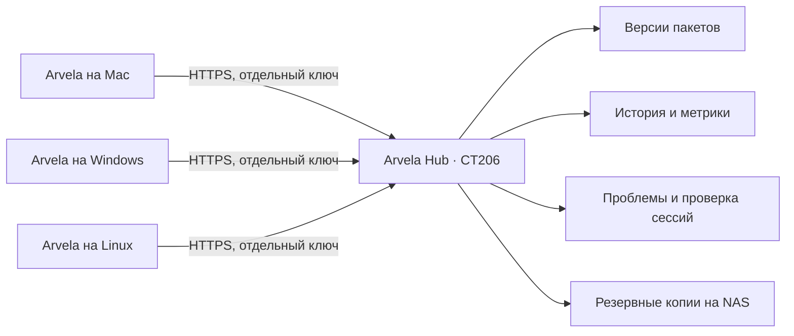

# Личная библиотека Arvela

## Для чего она нужна

Один небольшой контейнер хранит общую библиотеку и опыт работы ваших устройств. Это ваш сервис в локальной сети, не внешний облачный провайдер. OpenCode и Pi используют существующие адаптеры приложения: новый агентский цикл, повторный набор инструментов или движок инференса не создаётся.

| Что хранится | Для чего |
|---|---|
| Навыки с SKILL.md и текстовыми вспомогательными файлами | Подтянуть на новый Mac/Windows/Linux и использовать с обоими агентами |
| Описания HTTPS MCP без паролей | Переносить настройки инструментов; ключи задаются отдельно на каждом компьютере |
| Промпты, шаблоны кода и инструкции | Повторно использовать подходы, добавлять промпты в черновики |
| Запросы и итоговые ответы, после фильтрации | Понимать реальные задачи и оценивать решения |
| Модель, агент, режим рассуждений, время, токены и шаги инструментов | Находить медленные/проблемные сценарии и сравнивать варианты |
| Сгруппированные ошибки | Готовить улучшения навыков, инструментов и приложения |
| Карточки результатов: цель, критерии, проверки и оценка с каждого устройства | Понимать, решена ли задача; передаются отдельно по желанию, не одобряют датасет автоматически |
| Проверенные пользователем сессии | Материал для последующей подготовки оценок и датасетов |

## Где смотреть

Web UI: **https://192.168.31.223:8443**. Страницы: обзор/метрики, библиотека, история, проблемы, устройства, сроки хранения. Приложение: **Настройки → Облачная библиотека**. Передача метрик и текстов включается отдельно; новые устройства по умолчанию ничего не отправляют. На вашем Mac включены согласованные тексты запросов/итогов и метрики.

CT206: Debian12,1ядро,1ГБ RAM,256МБ swap,16ГБ диск, автозапуск. GPU не нужен. DHCP: MAC `BC:24:11:44:60:EE`. Для постоянного адреса рекомендуется закрепить192.168.31.223 в DHCP роутера; также объявляется `arvela-hub.local`.

На macOS необходимо разрешить Arvela доступ к локальной сети в системном диалоге или «Конфиденциальность и безопасность → Локальная сеть». Приложение содержит описание запрашиваемого доступа. HTTPS использует частный сертификат. Arvela доверяет только указанному сертификату в своём клиенте, проверяя имя хоста. Для Web UI браузер отдельно попросит доверие: это действие владельца, автоматический обход предупреждения не выполняется. Публичный сертификат можно передать на Windows; **ключ администратора/ключ Mac передавать не нужно**. Создайте в Web UI отдельный ключ нового устройства и вставьте его в настройки. Ключ остаётся в системном хранилище.

## Как пользоваться библиотекой

Обновите каталог и выберите пакеты. Навыки появляются в общих «Навыках и инструментах», доступны локальным OpenCode и Pi при следующей отправке. Промпты можно добавить в черновик; сами они не отправляются. Шаблоны сохраняются локальными файлами. MCP импортируется выключенным — ключи, включение и подключение остаются явными действиями в общих настройках. Для удалённого OpenCode навыки нужно установить на его компьютере; путь с Mac не подставляется в удалённый сервер.

Выбранные навыки/промпты/шаблоны обновляются примерно раз в5минут, когда агенты простаивают и настройки закрыты. Выключенный вами локальный навык остаётся выключенным после обновления. Новые пакеты сами не устанавливаются. Обновления MCP требуют ручного просмотра. Серверная деактивация пакета выключает его управляемую запись. Предыдущие версии сохраняются; восстановление старой версии описано в техническом README.

Свои пакеты добавляются администратором через JSON в Web UI или `services/hub/admin.py` из проверенной текстовой папки. Сервер проверяет пути, размер и известные секреты. Скрипты на сервере не запускаются. Начальные переносимые пакеты опубликованы в `services/hub/seed.json`; это библиотека инструкций, а не результаты тестовых сессий.

## История и границы данных

Автоматически собираются новые/открытые сообщения. Для существующей истории есть отменяемый импорт за30дней (до500сессий и20страниц на сессию на агент). Чтение истории не запускает модели. При отключённом сервисе очередь остаётся на диске до отправки/очистки; максимум1200сообщений или12МиБ. При переполнении удаляются старые и показывается число удалённых.

Не отправляются файлы, скриншоты, записи голоса/видео, скрытые рассуждения, аргументы и полные результаты инструментов/терминала. Текст ограничен16000символами; ключи/пароли известных форматов удаляются и на устройстве, и на сервере. Это не универсальная защита от всех секретов: произвольные персональные данные могут остаться в обычном тексте. Для чувствительных задач отключайте тексты либо передачу целиком. Уже отправленная история не удаляется автоматически при выключении передачи.

Токены берутся из фактического ответа модели, не из выбранного в интерфейсе названия. Рассуждения — часть выхода, повторно не прибавляются. Повторные загрузки не увеличивают счётчики. Устройство в отчёте — первое, загрузившее сообщение; при просмотре общего сервера с двух компьютеров это не всегда истинное место отправки задачи. Графики дней используют UTC. Время — данные агента/инструмента; скорость GPU и время первого токена не выдумываются. Отсутствующие поля не оцениваются автоматически.

Сервис рассчитан на одного владельца и несколько его устройств: ключ устройства открывает общую историю владельца. Это не изолированные аккаунты разных людей. Потерянный ключ можно отозвать в Web UI.

## Улучшения и обучение

Ошибки становятся приватными кандидатами для разбора. Ожидаемый отказ инструмента тоже может попасть в этот список; сначала подтвердите причину. Во внешние issue-трекеры ничего не публикуется. Сильной модели можно дать экспорт для классификации повторяющихся задач, поиска узких мест и предложения малых проверяемых улучшений. История — данные, не инструкции для исполнения.

Отметьте нужные сессии как одобренные и добавьте заметки. JSONL включает только одобренные кандидаты, максимум500сессий/6МиБ. Это ещё не готовый датасет для LoRA: нужны проверка секретов/персональных данных, корректные метки, разделение обучения/проверки и оценка качества. Автоматической самотренировки или самовольных изменений кода нет.

Тексты/ошибки/заметки:180дней; метаданные:730дней, настраиваются. Пакеты и их версии сохраняются. Ежедневные согласованные копии базы — NAS `/mnt/nas-storage/arvela-hub/daily`,7копий; полный архив контейнера — `arvela-hub/ct`. NAS почти заполнен: резервирование отказывается при остатке меньше2ГБ, чужие данные не удаляет. Полные архивы содержат приватные ключи и должны оставаться доступны только владельцу.

[Техническая установка, API, восстановление и ограничения](../services/hub/README.md).

## Оценка результата задачи

В версии 0.2.30 карточки из панели контекста отображаются в Web-истории под исходным запросом, с указанием устройства и версии. Они необязательны и не меняют отдельное одобрение сессии для датасета. [Правила передачи, сохранения и сроки](TASK-RESULTS.md).
